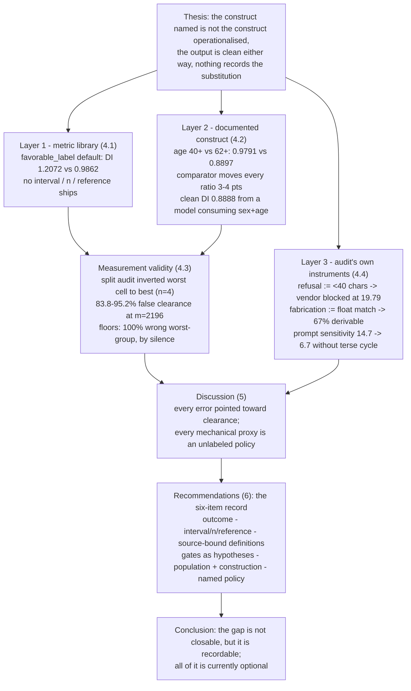

# Paper map — report_facct.tex

Two views of the paper: the argument as a graph, and the instance inventory as
a matrix that ties every finding to the recommendation it justifies. Section
labels are stable across the FAccT restructure.

## The argument as a graph

## The inventory as a matrix

| # | Layer | Construct named | Operationalised as | Headline number | Section | Feeds rec. |
|---|-------|-----------------|--------------------|-----------------|---------|------------|
| 1 | Library | "favorable outcome" | constructor default `favorable_label=1.0` | DI 1.2072 vs oriented 0.9862 | 4.1 | R1 |
| 2 | Library | "disparate impact" | bare point ratio, no interval/n | 0.6734 @ n=31 prints like 0.9604 @ n=4,019 | 4.1, 4.3.1 | R2 |
| 3 | Library | "compared to whom" | unrecorded reference convention | every ratio moves 3–4 pts | 4.2.2 | R2 |
| 4 | Construct | "age" (protected class) | banded age at 40+ | 0.9791/LOW vs 0.8897 at 62+ | 4.2.1 | R3 |
| 5 | Construct | "discrimination" | outcome-rate disparity only | clean DI 0.8888 from model consuming sex+age | 4.2.3 | R3, R4 |
| 6 | Validity | "worst-treated group" | point-estimate ranking on a split | 1.1504 @ n=4 vs 0.6734 population | 4.3.1 | R2, R5 |
| 7 | Validity | "reportable cell" | reporting policy (floor/interval/shrinkage) | 83.8–95.2% false clearance; floors 100% wrong-by-silence | 4.3.2 | R5, R6 |
| 8 | Instrument | "refusal" | narrative field < 40 chars | 6/9 false flags; vendor blocked at 19.79 | 4.4.1 | R4 |
| 9 | Instrument | "fabrication" | float literal absent from context | 17 vs 4 flags; 67% derivable | 4.4.2 | R4 |
| 10 | Instrument | "mitigation" | canonical algorithm name | fails exactly the data-scarcity cases | 4.4.3 | R4 |
| 11 | Instrument | "severity" | cuts at 0.72 / 0.80, no provenance | authoritative-looking band labels | 4.4.4 | R3 |
| 12 | Instrument | "capability" | mean over heterogeneous tasks | 75% = 33.3/91.7/100; spread 14.7 → 6.7 | 4.4.5 | R4 |

Recommendations (Section 6): **R1** favorable outcome as required argument ·
**R2** interval, n, reference beside every ratio · **R3** definitions bound to
their documented source · **R4** every gate treated as a hypothesis ·
**R5** audit the population, disclose construction · **R6** name the
reporting policy.

Reading the matrix: every row shares the same three-part shape (named /
operationalised / clean number), which is the thesis; every recommendation is
reachable from at least one row, and no recommendation lacks a measured
failure behind it.
